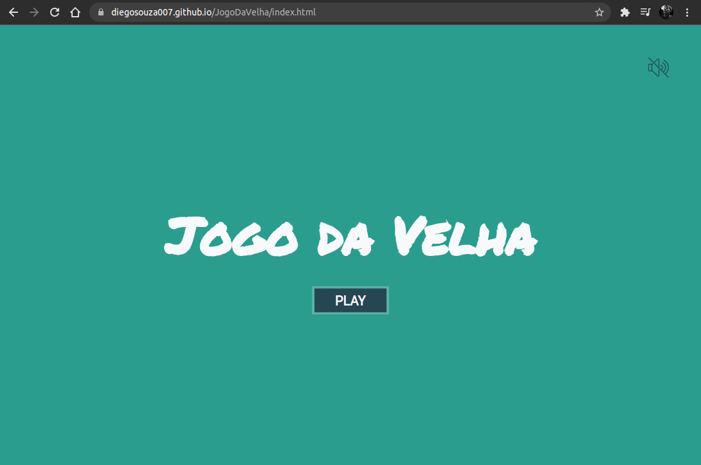
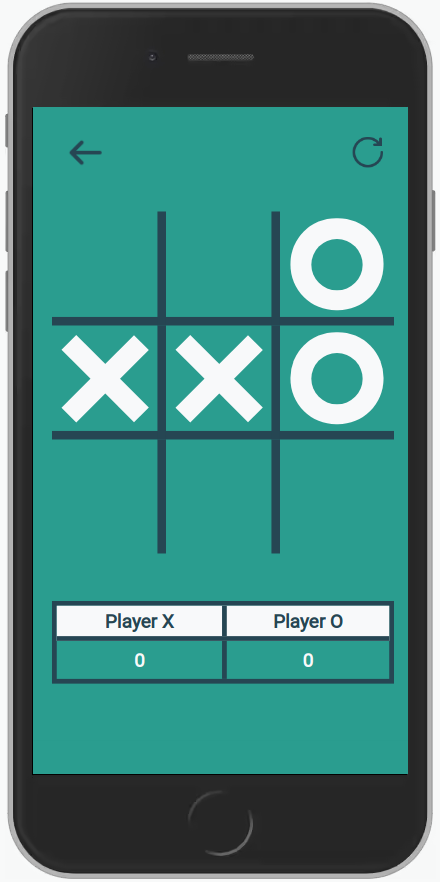

# JogoDaVelha

  
  
  
  

Um jogo desenvolvido com JavaScript puro do famoso Tic Tac Toe ou mais popularmente conhecido aqui no Brasil: Jogo da Velha.

Este foi mais um dos desafios que recebemos através do curso ProgramadorBr, onde precisaríamos desenvolver um jogo da velha simples usando JavaScript. 

É um excelente projeto para colocarmos em prática a nossa lógica de programação e aplicarmos parte dos conhecimentos já obtidos até o presente momento. É como diz aquela famosa frase: "practice makes perfect".

Neste projeto tivemos uma introdução de como implementarmos em nosso código o padrão MVC(Model, View, Controller) para separarmos a parte da lógica de negócio(Model) da interface do usuário(View). Para isso utilizei um arquivo(interface.js) como um intermediador(Controller) entre ambos para nele ser definido como os dados serão disponibilizados para o usuário.

## Tecnologias

- HTML5
- CSS3
- JavaScript

## Preview do projeto

Demo: <a href="https://diegosouza007.github.io/JogoDaVelha">https://diegosouza007.github.io/JogoDaVelha</a>