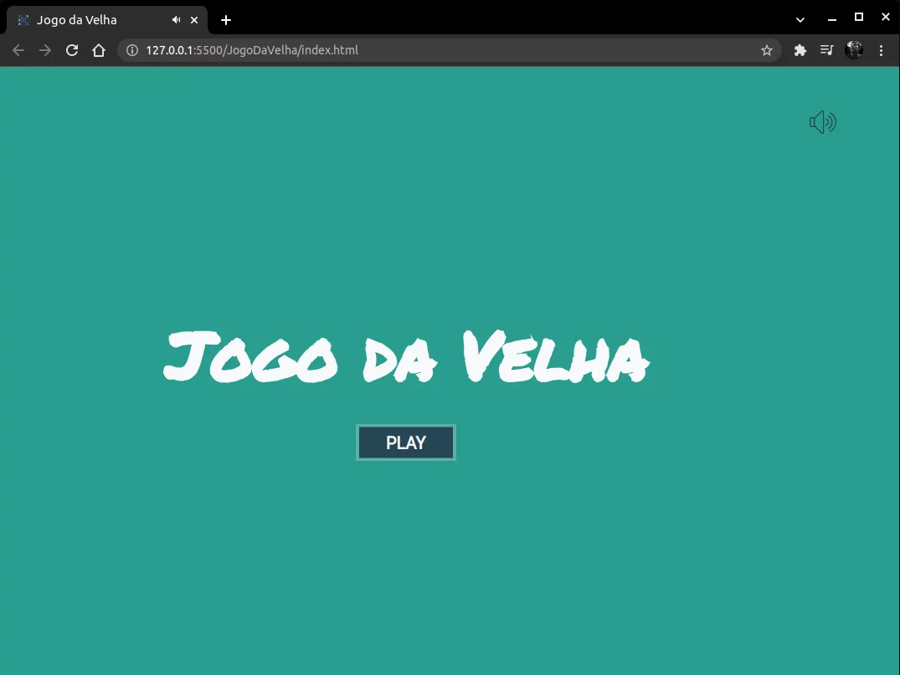

# JogoDaVelha

>>> <em>Em desenvolvimento...</em>

Um jogo desenvolvido com JavaScript puro do famoso Tic Tac Toe, ou mais popularmente conhecido aqui no Brasil: Jogo da Velha.

Este foi mais um dos desafios que recebemos através do curso ProgramadorBr. É um excelente projeto para colocarmos em prática a nossa lógica de programação e aplicarmos parte dos conhecimentos já obtidos até o presente momento. Como diz aquela famosa frase: "practice makes perfect".

Neste projeto utilizamos também uma noção do padrão MVC(Model, View, Controller) para separarmos a parte da lógica de negócio(Model) da interface do usuário(View). 

Para isso utilizei um arquivo(interface.js) como um intermediário(Controller) entre ambos para ser definido como os dados serão disponibilizados para o usuário.

# Spoiler preview...

